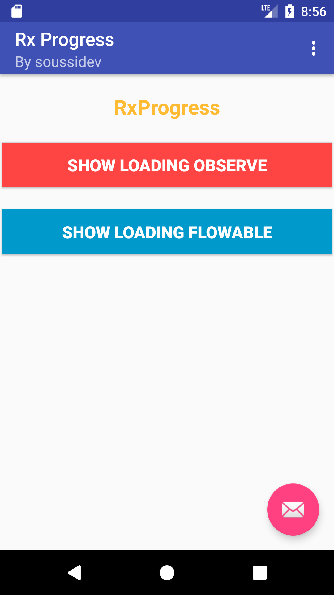
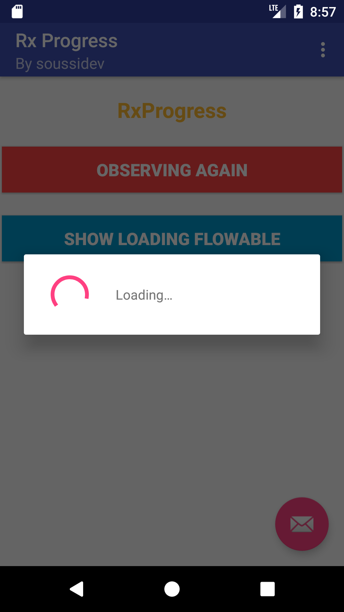
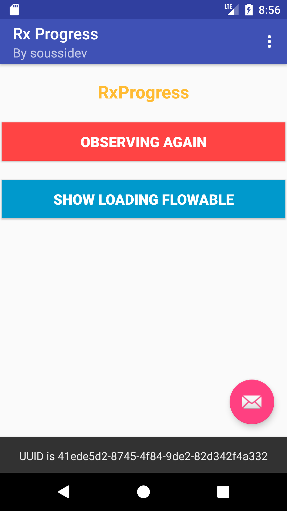

# RxProgress
RxPregress with Nice Animation

[]()
[]()
[](https://jitpack.io/#datalink747/RxProgress)

<a href='https://ko-fi.com/A243447K' target='_blank'></a>

# Preview :
<table>
<tr align="center">
<td>
<p>Interface 1 </p>

</td>
<td>
<p>Start Loading </p>

</td>
   <td>
<p>Resultat </p>

</td>
</tr>
</table> 

# Code :
> RxProgress
```java
 //Init Observe for btn observe
        user_Observable = Observable
                .timer(TIME_DELAY, TimeUnit.MILLISECONDS, AndroidSchedulers.mainThread())
                .doOnTerminate(() -> btn_loading_observe.setText("Observing Again"))
                .doOnComplete(() -> AnimationView()) //if complete show animation
                .map(aLong -> getMessageResult()); //Call function messageresult()

        //Init Flowable for btn Floable
        user_Flowable = Flowable
                .timer(TIME_DELAY, TimeUnit.MILLISECONDS, AndroidSchedulers.mainThread())
                .doOnComplete(() -> btn_loadig_flowable.setText("Flowable Again"))
                .doOnComplete(() -> AnimationView()) //if complete show animation
                .map(aLong -> getMessageResult());  //Call function messageresult()

    }
    
    
    
    
    //btn observe
        btn_loading_observe.setOnClickListener(view->{

            mCompositeDisposable.add(RxProgress.from(MainActivity.this)
                    .withMessage("Logging in...")
                    .forObservable(user_Observable)
                    .subscribe(id -> getMessage(id),
                            throwable -> Log.w(TAG, throwable.getMessage())));

        });

        //btn Flowable
        btn_loadig_flowable.setOnClickListener(view ->{

            mCompositeDisposable.add(RxProgress.from(MainActivity.this)
                    .forFlowable(user_Flowable, BackpressureStrategy.DROP)
                    .subscribe(id -> getMessage(id),
                            throwable -> Log.w(TAG, throwable.getMessage())));

        } );
```

# Code :
> Init Animation
```java

 AnimationHelper p =new AnimationHelper(AnimationScale.TransLationTop);
        p.animateGroup(findViewById(R.id.btn_loading_observe),findViewById(R.id.btn_loading_flowable),findViewById(R.id.fab));

```

# Add dependencie to your project :

```gradle
allprojects {
		repositories {
			...
			maven { url 'https://jitpack.io' }
		}
	}	
```

```gradle

dependencies {
    compile 'com.github.datalink747:RxProgress:1.0'
}
```

# Include:
[](https://github.com/datalink747/RxProgress/blob/master/app/src/main/java/com/soussidev/kotlin/rxprogress/MainActivity.java)


# SDK Required
+ Target sdk:<br>
[](https://android-arsenal.com/api?level=26)
+ Min sdk:<br>
[](https://android-arsenal.com/api?level=19)

# Social Media
<table style="border:0px;">
   <tr>
      <td>
<a href="https://www.linkedin.com/in/soussimohamed/">

</a>
      </td>
      <td>
         <a href="https://twitter.com/soussimohamed7/">

</a>
     </td>
	   <td>
         <a href="https://plus.google.com/u/0/+SoussiMohamed747">

</a>
     </td>
  </tr> 
</table>   

# Licence
```
Copyright 2017 Soussidev, Inc.

Licensed under the Apache License, Version 2.0 (the "License");
you may not use this file except in compliance with the License.
You may obtain a copy of the License at

   http://www.apache.org/licenses/LICENSE-2.0

Unless required by applicable law or agreed to in writing, software
distributed under the License is distributed on an "AS IS" BASIS,
WITHOUT WARRANTIES OR CONDITIONS OF ANY KIND, either express or implied.
See the License for the specific language governing permissions and
limitations under the License.
```
